# awesome-wordle-games

😎 Awesome list of wordle-like games

## What is [Wordle](https://www.nytimes.com/games/wordle/index.html)

Wordle is simple: You have six chances to guess the day's secret five-letter word. Type in a word as a guess, and the game tells you which letters are or aren't in the word. The aim is to figure out the secret word with the fewest guesses.


This repository is intended to list the awesome wordle-like games out there. Pull requests are open to anyone to add other wordle-like games that are awesome!

# Format

Each package is listed in the following format:

``` markdown
[Game Name](link/to/game)

Short package description

[![IMAGE IF APPLICABLE]](link/to/game)
```

## [Worldle](https://worldle.teuteuf.fr/)

Guess the WORLDLE in 6 guesses.

Each guess must be a valid country, territory.

After each guess, you will have the distance, the direction and the proximity from your guess and the target country.

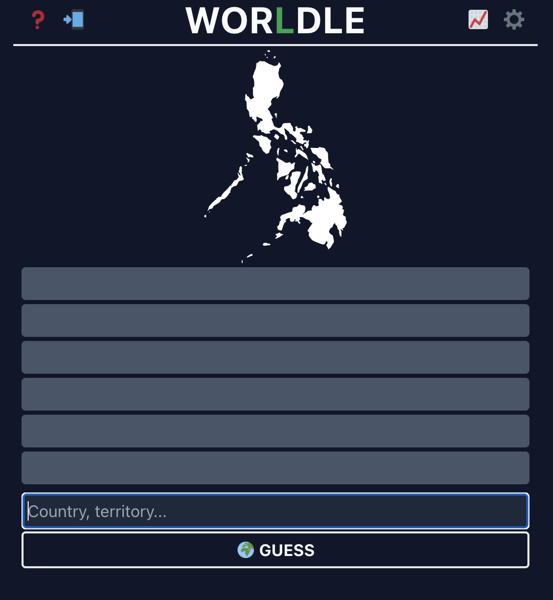

## [Nerdle](https://nerdlegame.com/)

Each guess is a calculation.

You can use 0 1 2 3 4 5 6 7 8 9 + - * / or =.

It must contain one “=”.

It must only have a number to the right of the “=”, not another calculation.

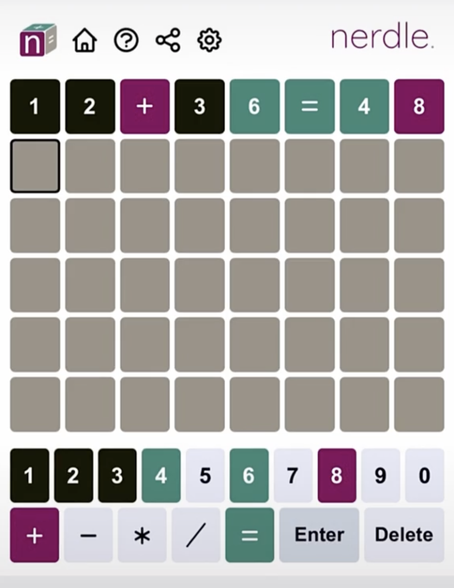

## [Quordle](https://www.quordle.com/)

Put your skills to the test and solve four Wordles at once! 

You have 9 guesses to solve all four words. 

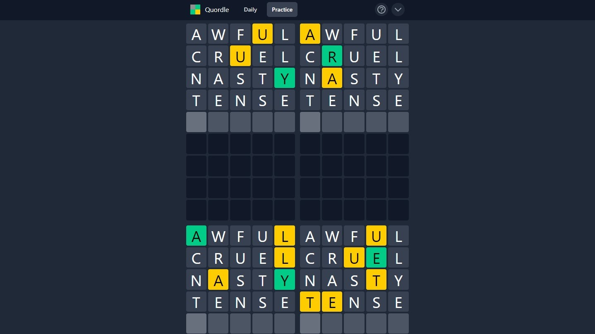

## [Heardle](https://www.heardle.app/)

Guess the song from the intro in as few tries as possible.

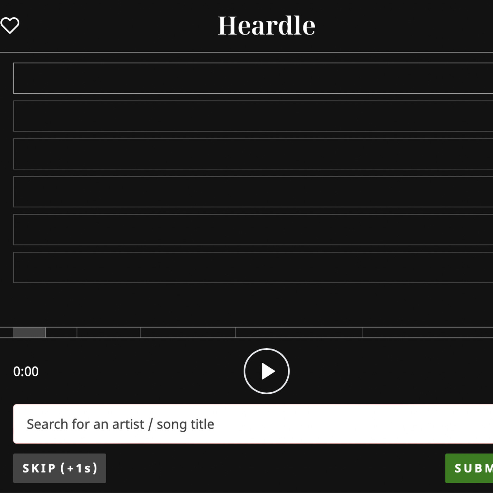

## [Framed](https://framed.wtf/)

Guess the movie from the images. New movie each day!


## [Waffle](https://wafflegame.net/)

What is it? Wordle, but with six words plus drag-and-drop

Frequency: Daily

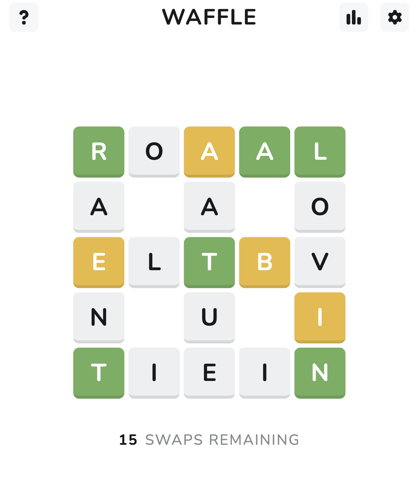

## [Crosswordle](https://crosswordle.vercel.app/)

Recreate a valid Wordle grid given the final row and color coded tiles for the guesses.

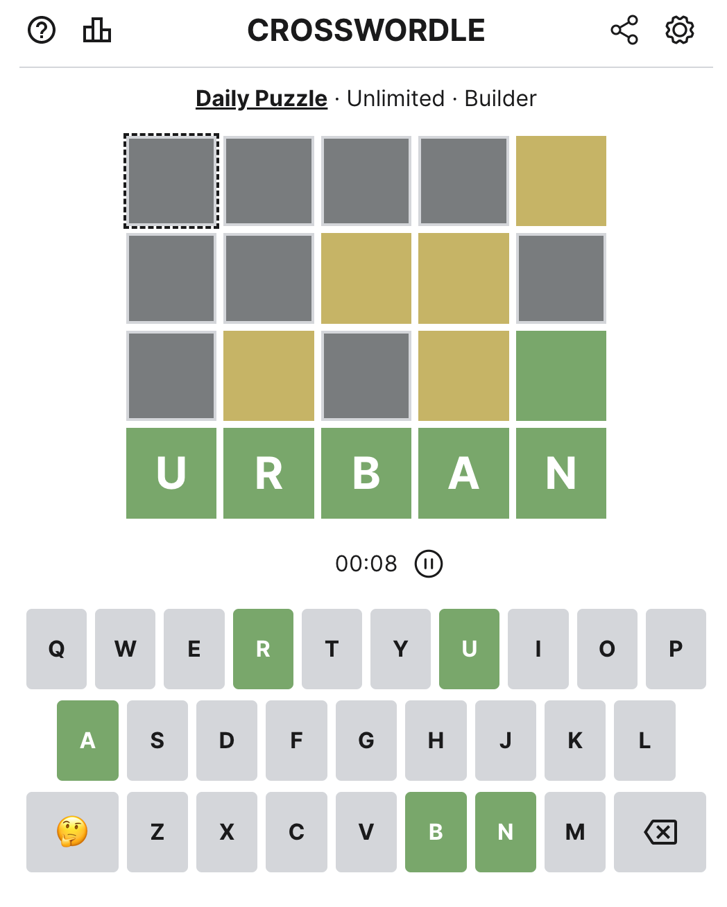

## [Dungleon](https://www.dungleon.com/)

What is it? Wordle, but a dungeon crawler

Frequency: Daily

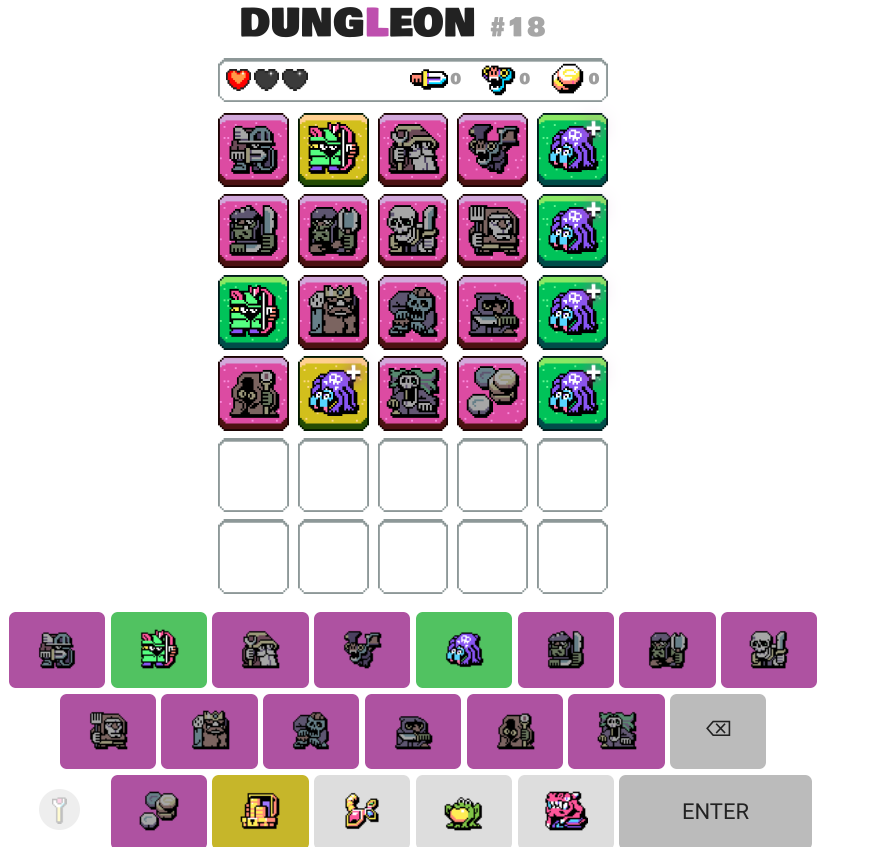

## [Squareword](https://squareword.org/)

What is it? Wordle, but a 5x5 square

Frequency: Daily

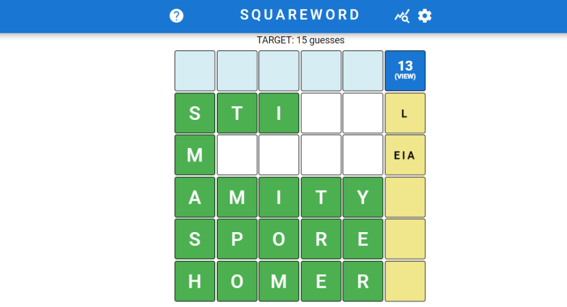

## [Squabble](https://squabble.me/)

Battle royale wordle

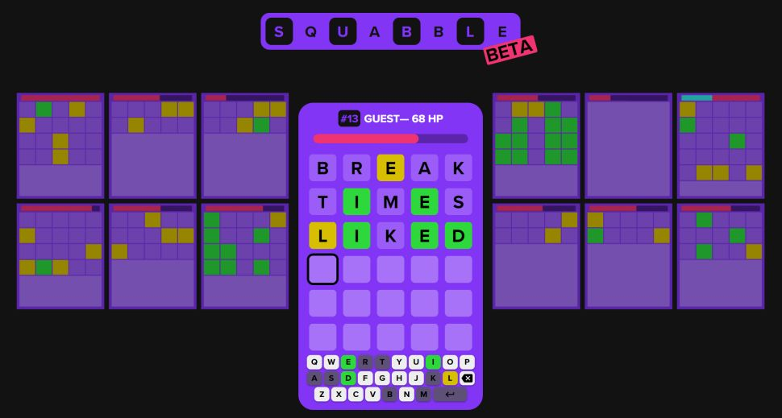

## [Globle](https://globle-game.com/)

Use your geography knowledge to figure out the mystery country in as few guesses as possible!

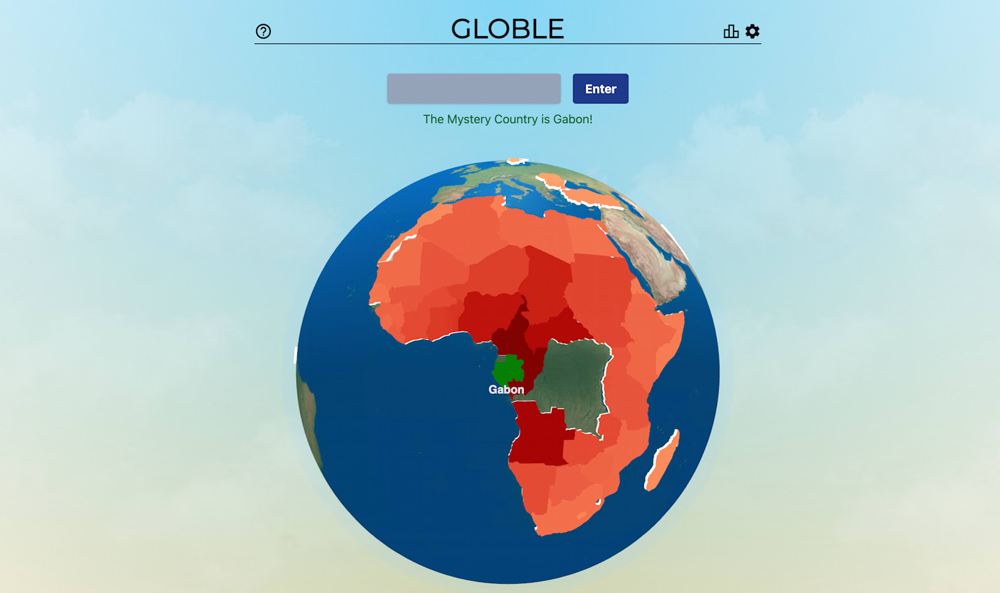

## [Absurdle](https://qntm.org/files/absurdle/absurdle.html)

An adversarial Wordle. "Adversarial" means that Absurdle is actively trying to avoid giving you the answer. With each guess, Absurdle reveals as little information as possible, changing the secret word if need be.


## [Duotrigordle](https://duotrigordle.com)

Put your skills to the test and solve thirty-two Wordles at once! You have 37 guesses to solve all 32 words. A new Duotrigordle available each day to solve.

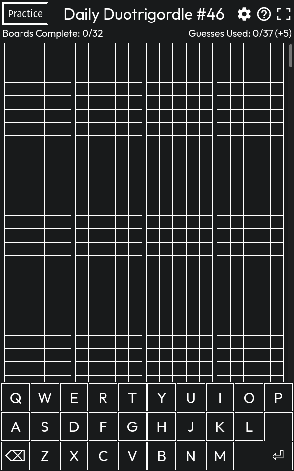

## [Letterle](https://edjefferson.com/letterle/)

Each day, the puzzle refreshes and has a new letter of the alphabet as the mystery letter.

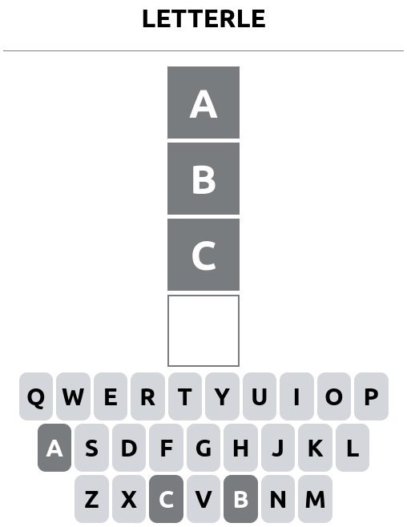

## [WordAll](https://wordall.xyz)

It's a bit like Wordle, but you have to guess ALL the words.

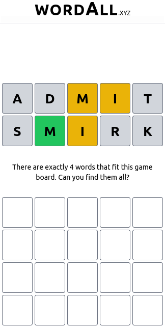
